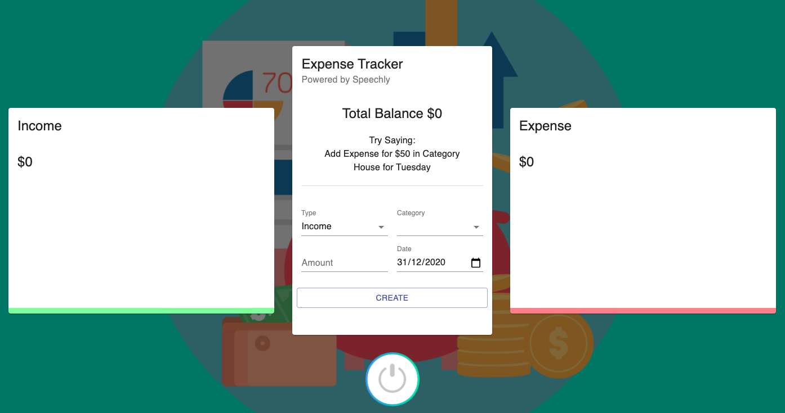

# Expense Tracker App

This is an expense tracker app created with React and Speechly. You can create different type of transaction like income and expense and see them visually appear using chartjs. It is also using Material UI for creating the UI.

## BUILD WITH

- ReactJS
- Speechly
- Context API
- Material UI

## Live Version

[Live Link](https://expense-tracker-react-speechly0.netlify.app)

# AUTHOR

- Github: [@mariosknl](https://github.com/mariosknl)
- Twitter: [@mariosknl](https://twitter.com/MariosKnl)
- Linkedln: [marios-kanellopoulos](https://www.linkedin.com/in/marios-kanellopoulos)
- Portfolio: [marios-kanellopoulos](https://marioskanellopoulos.com/)

# Acknowledgments

- [Javascript Master](https://www.youtube.com/channel/UCmXmlB4-HJytD7wek0Uo97A)

### 🤝 Contributing

Contributions, issues, and feature requests are welcome!
Feel free to check the issues page.
